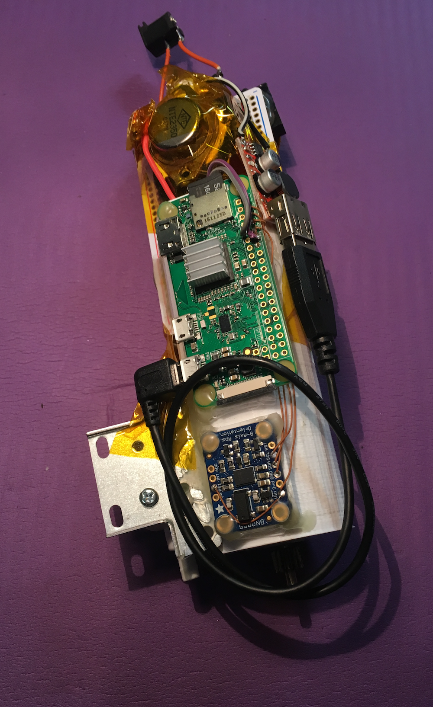
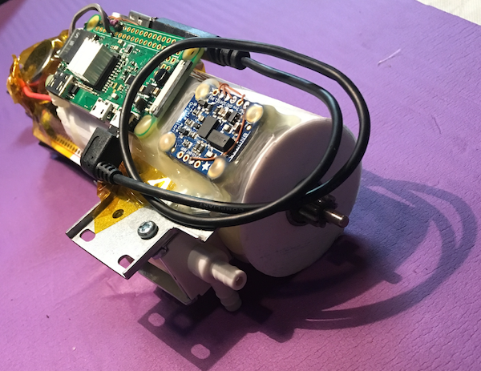

# Using CMA-ES algorithm for RPiZW motor control

Some projects get started for the simple reason you have the parts around, and an idea comes to mind.

One night I noticed I had the battery and motor from an old 12V hand-held power drill, and an [IMU BNO055 eval board](https://www.adafruit.com/product/2472). And the thought came to mind how I could control the motor turn-on/off timing to maximize, or minimize, the force that starting and stopping of the motor generates. It seemed for example this might be useful in applications where you want to turn on a motor, but minimize the amount of torque it generates during that startup. And just seemed a good enough waste of time...

[See it in action](https://youtu.be/Y5X0UnOKKN8)

## HW:
* RPi ZW
    UART to BNO055 (9DOF IMU),
    (1) IO to turn motor on/off, using PWM speed & duty cycle params
* 12v motor, using 12v drill clippable battery pack,
    or any 12v solenoid can be used

NOTE: The BNO055 supports I2C and UART interfaces. I2C would be preferable but the RPi has a bug with I2C clock stretching, which this BNO055 uses. So I had to wire to talk over UART at 115200 which is plenty fast enough to get samples off at it's 100Hz max update rate.
    
## CMA-ES:
* [CMA-ES](https://en.wikipedia.org/wiki/CMA-ES) is an evolutionary algorithm that allows finding a maximum/minimum in set of
    function/data. Here the fcn/data is from the BNO055. The
    algorithm is able to poke the world thru motor on/off
    times and  measure the response the BNO055. It
    then tries to maximize/minimize the linear acceleration it found by adjusting
    those on/off times

### The CMA-ES source came from https://github.com/beniz/libcmaes

# Main programs:

doc
    - datasheets & 1st enclosure cad for print to hold motor,rpi,bno

INSTALL
    - as it says, do these things

libcmaes
    - the actual CMA-ES lib you need to compile & install

bno055_motor_maximize_linacc_pwm
    - cpp: 2nd rev: now use hw pwm x[i],x[i+1]
    - Runs CMAES algorithm using BNO055 feedback, currently FitnessFunc
        is max/minimizing linear acceleration

shared
    - common cpp/py code

# When things don't run, to debug:

bno055_uart_interface-python
    - py: just read samples from BNO055

bno055_uart_interface-termios
    - cpp: just read samples from BNO055

# Prototype

